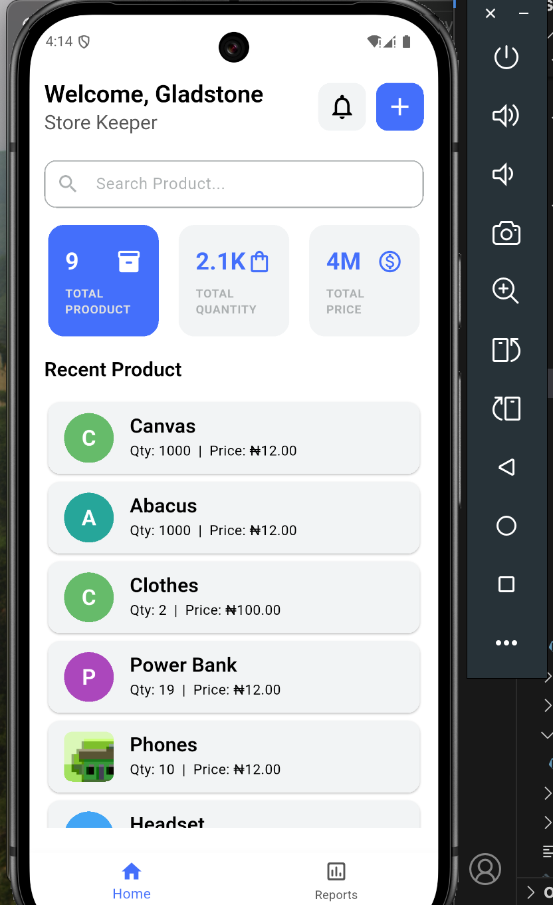
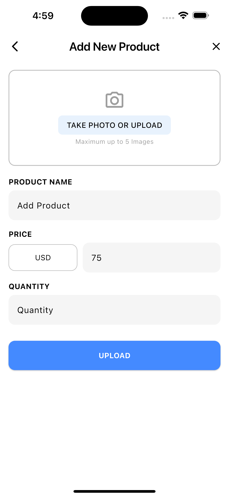
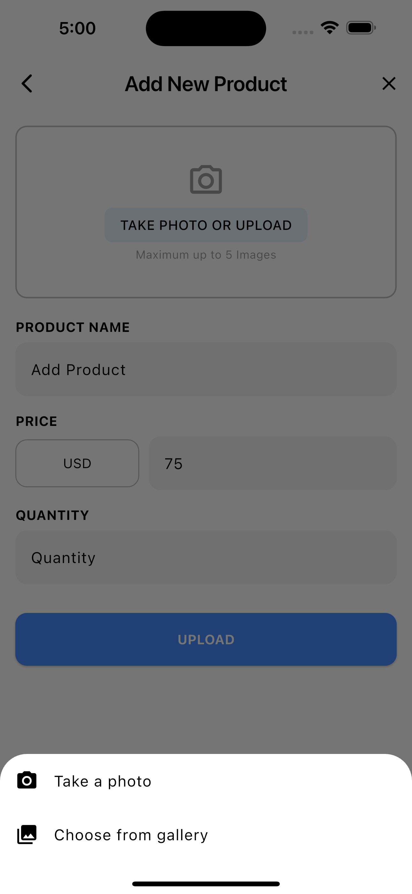
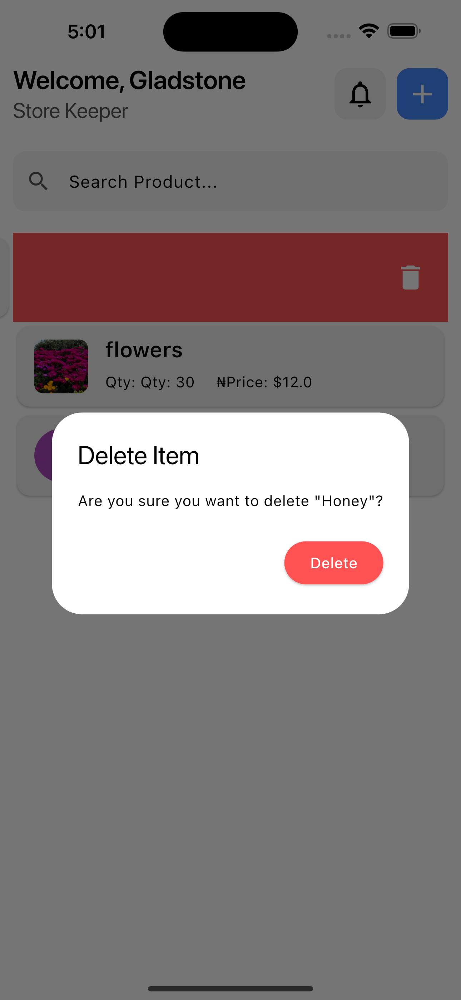
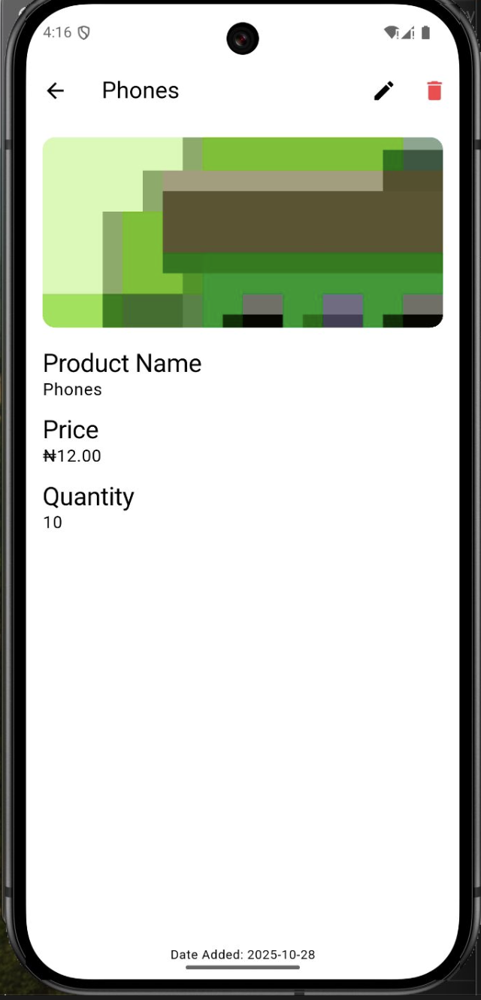

# 🏪 StoreKeeper App

A simple and beautiful Flutter app for managing product inventory locally.  
Built as part of the **HNG Internship (Stage 2)** — this app helps storekeepers easily **add, update, search, and delete** items while storing data offline using **SQLite**.

---

## 🚀 Features

- 📦 Add new items with name, price, quantity, and image  
- 🖼️ Capture or upload product photos  
- 🔍 Search through your inventory easily  
- 🗑️ Swipe to delete or update items  
- 💾 Local database storage with **Sqflite**

---

## 🛠️ Tech Stack

- **Flutter** (Dart)
- **SQLite** (via `sqflite` package)
- **Provider** for state management
- **Path Provider** and **Image Picker**

---
## 🔗 Links

- 📂 **GitHub Repository:** [https://github.com/PreciousGladstone/StoreKeeper](https://github.com/PreciousGladstone/StoreKeeper)
- 📱 **Download APK:** [https://drive.google.com/file/d/1a2b3c4d5e6f/view?usp=sharing](https://drive.google.com/file/d/1a2b3c4d5e6f/view?usp=sharing)
- 🎥 **Demo Video:** [https://drive.google.com/file/d/1sTALZKbagLYy9mnE32eL4aj_aZUUAdEq/view?usp=drive_link](https://drive.google.com/file/d/1sTALZKbagLYy9mnE32eL4aj_aZUUAdEq/view?usp=drive_link)

## 📱 Screenshots

 | |  | | 
---

## ⚙️ How to Run

1. Clone the repository:
   ```bash
   git clone https://github.com/your-username/storekeeper_app.git